<div align="center">

# Autónoma GPS

<p align="center">
  
</p>


### Final Degree Project - Computer Engineering 2024/2025 at Universidade Autónoma de Lisboa

*An **indoor GPS navigation system** for visually impaired students at UAL, providing real-time audio guidance.*

</div>

## About the Project

> This README provides a structured overview of the project. For a comprehensive and in-depth explanation of every technical decision, system architecture, beacon mapping, algorithm implementation, challenges faced, and future work **read the full report**:
>
> **[Access the Full Project Report](android/report/Report.pdf)** &nbsp;|&nbsp; **[Watch the Project Video](https://www.youtube.com/watch?v=wC5PRanA4iI)**
>

Independent mobility in indoor environments remains a major challenge for visually impaired people, especially in complex spaces like a university campus. **Autónoma GPS** was developed in direct response to this need, in collaboration with the **Office for Inclusion and University Resilience (GIRU)** at UAL and with the direct input of a blind student from the institution itself.

The app uses **Bluetooth Low Energy (BLE) Beacons** strategically placed across all floors of the building (Floor -1 to Floor 4) to determine the user's position in real time. Based on that location, the system calculates the most efficient route using **Dijkstra's Algorithm** and delivers clear, adapted audio instructions - enabling fully autonomous navigation indoors.

### Highlights
- **38 beacons** installed across 6 floors of the UAL campus
- Fully **hands-free navigation** via voice commands
- **Android & iOS** support from a single codebase
- Interface designed from **real feedback** from a blind user
- Audio instructions available in **Portuguese, English and French**

## Features

| Feature | Description |
|---------|-------------|
| **Navigation Mode** | Select a destination and receive step-by-step audio instructions |
| **Guided Tour Mode** | Explore campus points of interest with automatic narration |
| **Voice Commands** | Full app control without touching the screen |
| **Text-to-Speech (TTS)** | Real-time audio instructions with adjustable speed and volume |
| **Favourites** | Save frequent destinations for quick access |
| **Sound Settings** | Customise voice, language, speed and volume |
| **Accessibility Settings** | Adjust contrast, text size and vibration feedback |
| **Map Settings** | Configure the UAL indoor map display preferences |
| **Light / Dark Mode** | Visual themes for greater comfort |
| **Multilingual** | UI available in Portuguese, English and French via JSON files |
| **Privacy Policy** | Informed consent popup on first launch |

## System Architecture

<p align="center">
  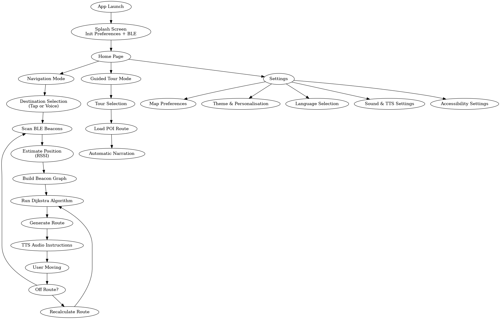
</p>

## Pages & Functionality

### 1. Splash Screen

The initial screen displaying the **Autónoma GPS** visual identity, initialising the beacon connection and loading the user's saved preferences. On first launch, it also presents the Privacy Policy popup for informed consent.

<p align="center">
  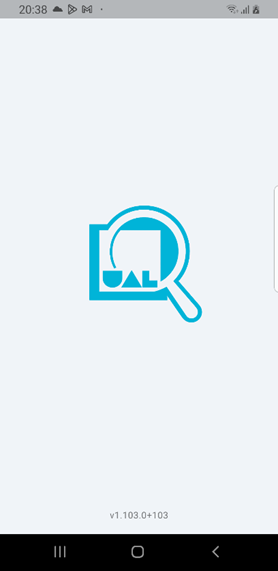
</p>

### 2. Home Page

The central hub of the app, providing direct access to the two main modes: **Navigation** and **Guided Tour**, as well as the app settings.

<p align="center">
  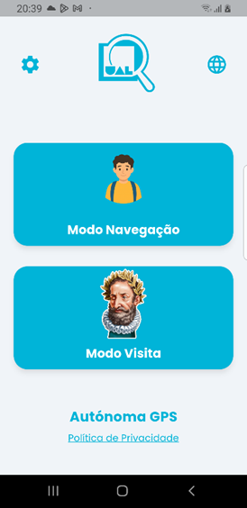
</p>

### 3. Navigation Mode

The functional core of the system. The user selects a destination (by tap or voice command) and the app calculates the most efficient route based on the current position estimated by the nearest BLE beacons.

<p align="center">
  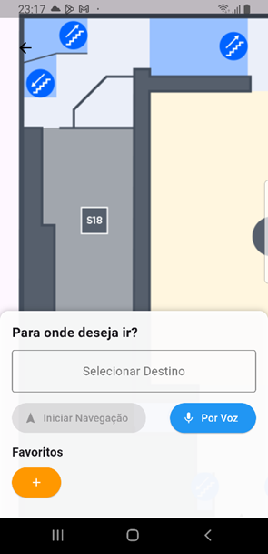
  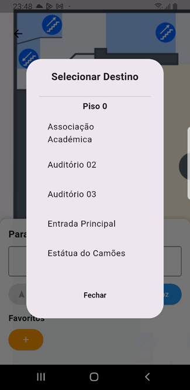
  
  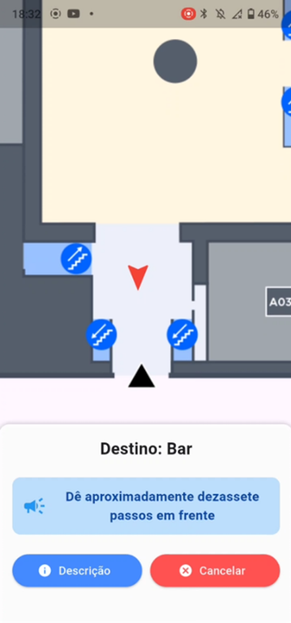
</p>

**How it works:**

1. The user selects a destination or accesses a saved favourite
2. The system detects the nearest BLE beacons and estimates position via RSSI
3. Dijkstra's Algorithm calculates the optimal route through the beacon graph
4. Audio instructions are delivered in real time via TTS
5. Position is continuously updated as the user moves
6. If the user deviates from the route, the system automatically recalculates

> 💡 Voice command mode enables a fully hands-free experience, users can select destinations, access favourites, and control navigation using only their voice.

### 4. Guided Tour Mode

Allows the user to follow a **pre-defined route** through the campus points of interest, with automatic narration at each location. Ideal for new students or visitors who want to explore the facilities independently.

<p align="center">
  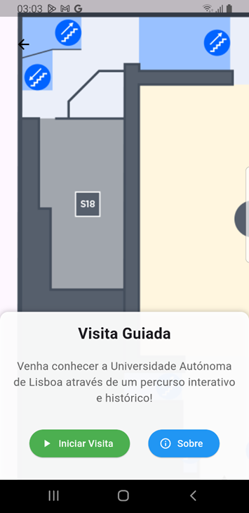
  
  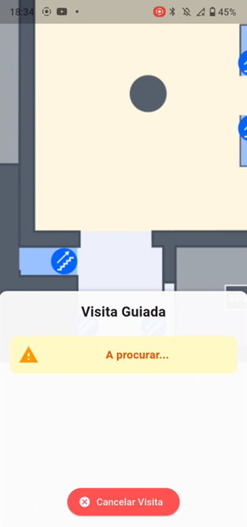
  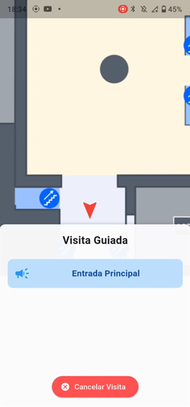
  
</p>

> ⚠️ In the current version, the tour always starts from the main entrance. The ability to start from any point is planned for future development.

### 5. Settings
<p align="center">
  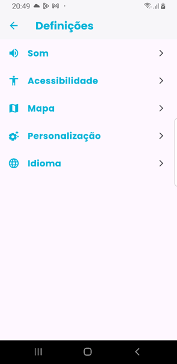
</p>

Full control over the app experience, organised into five sections:

<div align="center">

| Section | What it configures |
|:---|:---|
| **Sound** | TTS voice, speed, volume, language and audio files |
| **Accessibility** | Contrast, text size, vibration and feedback type |
| **Map** | UAL indoor map display preferences |
| **Personalisation** | Light/dark theme and visual settings |
| **Language** | Portuguese / English / French |

</div>

## Hardware - BLE Beacons

<p align="center">
  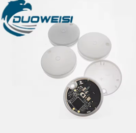
  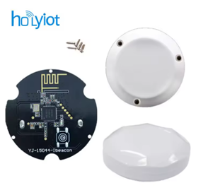
</p>

The system uses **38 beacons** distributed across all 6 floors of the UAL building (Floor -1 to Floor 4), using Apple's **iBeacon** protocol, compatible with both Android and iOS.

| Model | Manufacturer | Role | Protocol | Battery |
|-------|-------------|------|----------|---------|
| **nRF51822** | DUOWEISI | Initial testing | iBeacon | CR2032 |
| **Y1 (nRF51822-15044)** | Holyiot | Final installation | iBeacon | CR2477 |

The Holyiot Y1 beacons were selected for the final deployment due to their **superior robustness, battery life, signal stability and ease of configuration** compared to the initial test models.

<p align="center">
  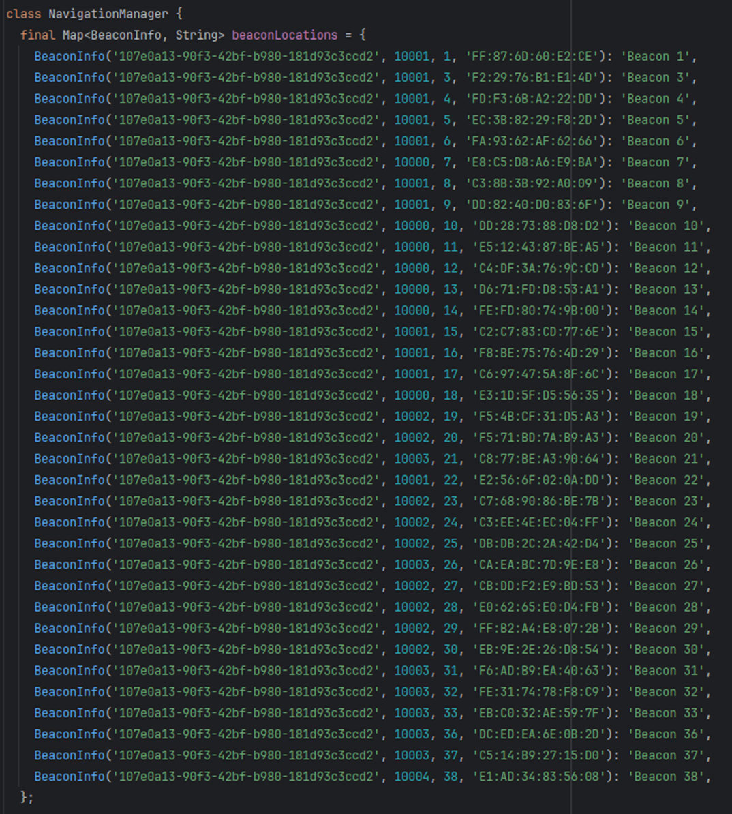
</p>

**Each beacon is identified by:**
- **UUID** - Unique identifier for the project's beacon set
- **Major** - Identifies the floor/zone within the building
- **Minor** - Identifies the specific location within the floor
- **RSSI / Tx Power** - Used to estimate the distance between the user and the beacon

## Floor Distribution

<p align="center">
  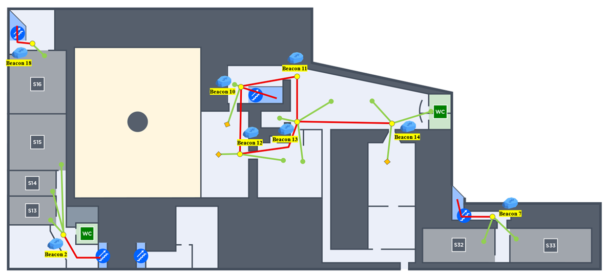
  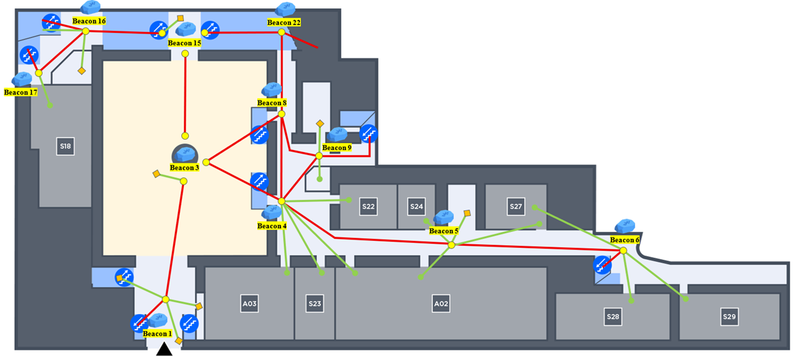
  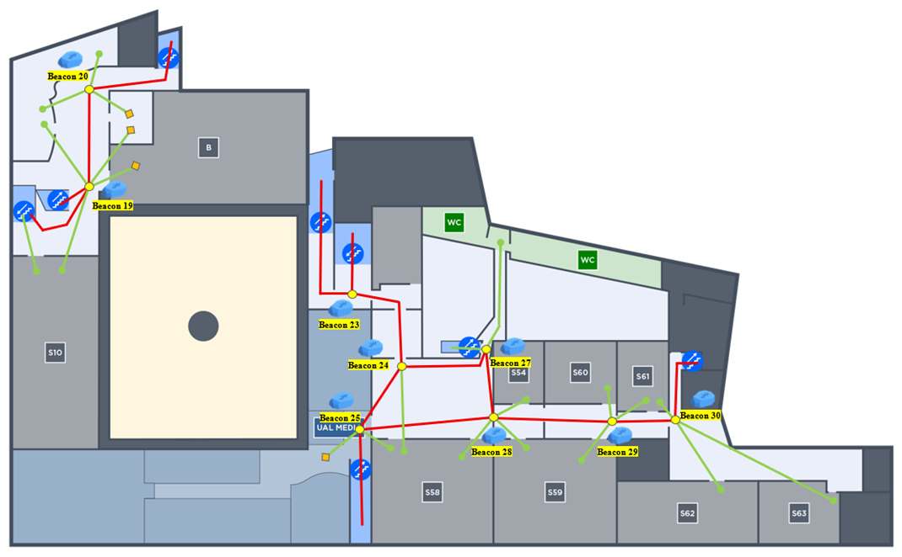
  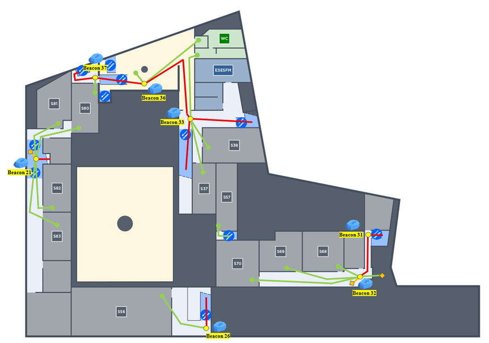
  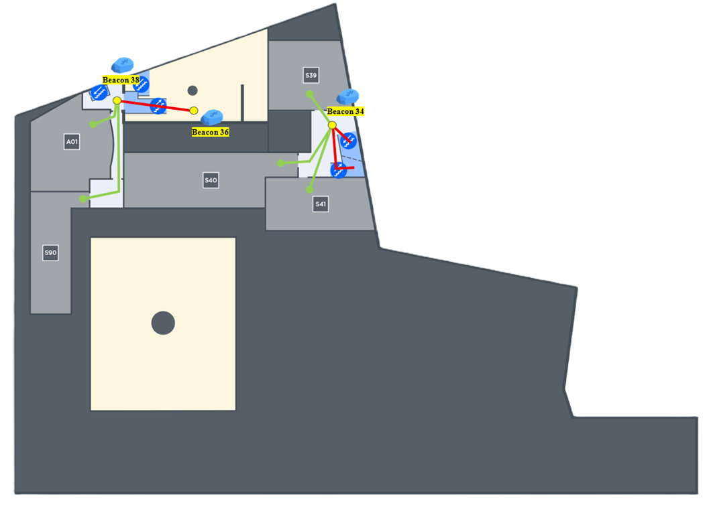
</p>

| Floor | Beacons Installed |
|-------|-------------------|
| Floor -1 | Covered |
| Floor 0 | Covered |
| Floor 1 | Covered |
| Floor 2 | Covered |
| Floor 3 | Covered |
| Floor 4 | Covered |

> For detailed beacon placement maps and individual positioning, refer to the **[Full Project Report](android/report/Report.pdf)**.

## Dijkstra's Algorithm

**Dijkstra's Algorithm** is used to calculate the most efficient route between the user's current position and the selected destination. In this project:

- Each **beacon** corresponds to a **node** in the graph
- Each **connection between beacons** is an **edge**, weighted by step count, physical barriers, or accessibility of the path
- The algorithm iteratively selects the node with the lowest accumulated cost, progressively building the optimal path

**Execution steps within the app:**

1. **Graph construction** - physical UAL map converted into a beacon graph
2. **Origin node** - beacon closest to the user (highest RSSI)
3. **Route calculation** - Dijkstra finds the lowest-cost path to the destination
4. **Instruction delivery** - ordered beacon list converted into audio directions
5. **Real-time adaptation** - route deviations trigger automatic recalculation

## Technologies

| Technology | Purpose |
|------------|---------|
| **Flutter 3.19+** | Cross-platform UI framework (Android & iOS) |
| **Dart 3.9** | Core application language |
| **Bluetooth Low Energy (BLE)** | Indoor positioning via beacons |
| **iBeacon Protocol** | Beacon communication standard |
| **Dijkstra's Algorithm** | Optimal route calculation through the beacon graph |
| **Text-to-Speech (TTS)** | Real-time audio instructions |
| **Voice Recognition** | Hands-free control via voice commands |
| **JSON** | Route storage, translations and voice commands |
| **Visual Studio Code** | Initial development environment |
| **Android Studio** | Main IDE for build and physical device testing |
| **GitHub** | Version control and team collaboration |

## Setup & Installation

### Prerequisites

- Flutter SDK 3.19+
- Android Studio (with emulator or physical Android device)
- For iOS: Mac with Xcode installed
- Device with active Bluetooth BLE (for testing with real beacons)

### Steps

```bash
# 1. Clone the repository
git clone https://github.com/Tomasalexpt30/autonoma-gps.git

# 2. Navigate to the project folder
cd autonoma-gps

# 3. Install dependencies
flutter pub get

# 4. Run the app
flutter run
```

> **Note:** To test navigation features with real beacons, a physical Android device in developer mode is required, connected via USB to the computer running Android Studio.

## Documentation & Media

<div align="center">

| Resource | Description |
|----------|-------------|
| **[Full Project Report](android/report/Report.pdf)** | Complete technical documentation - architecture, beacon mapping, algorithm details, results and more |
| **[Project Video](https://www.youtube.com/watch?v=wC5PRanA4iI)** | Media coverage of the Autónoma GPS project |
| **[GitHub Repository](https://github.com/Tomasalexpt30/autonoma-gps)** | Source code and project files |
| **[GIRU — UAL](https://autonoma.pt/info-giru/)** | Office for Inclusion and University Resilience |

</div>

## Authors

Project developed as part of the **Bachelor's Degree in Computer Engineering** at **Universidade Autónoma de Lisboa.

| Student | Number |
|---------|--------|
| Tomás Fernandes Alexandre | 30011117 |
| Pedro Rafael Borlinhas Falcão | 30011093 |
| Nicolae Iachimovschi | 30011284 |
| Guilherme Monteiro Brito | 30010959 |

> **Supervisor:** Professor Doutor Mário Marques da Silva | **July 2025**


